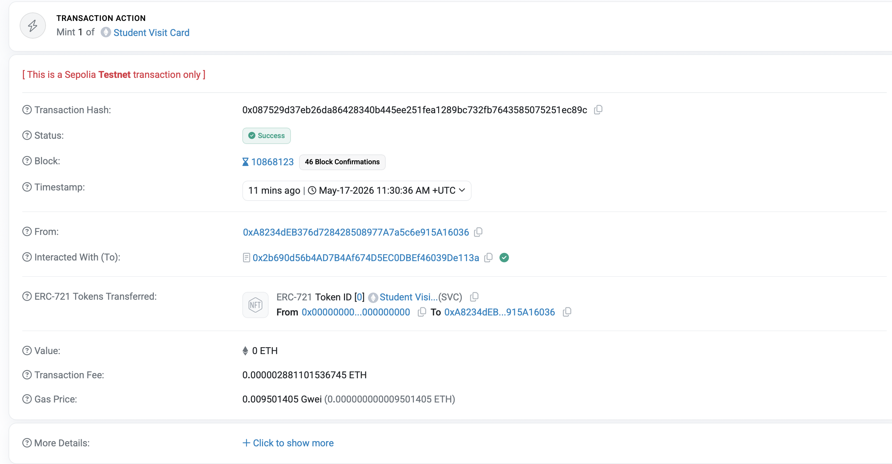
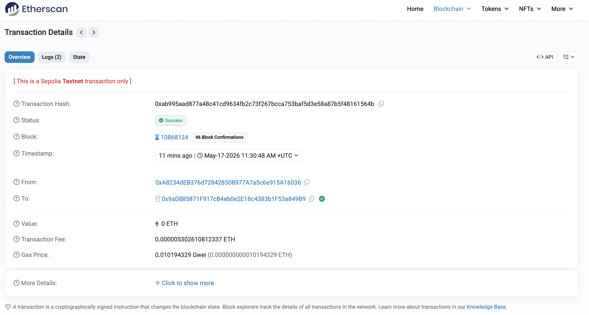
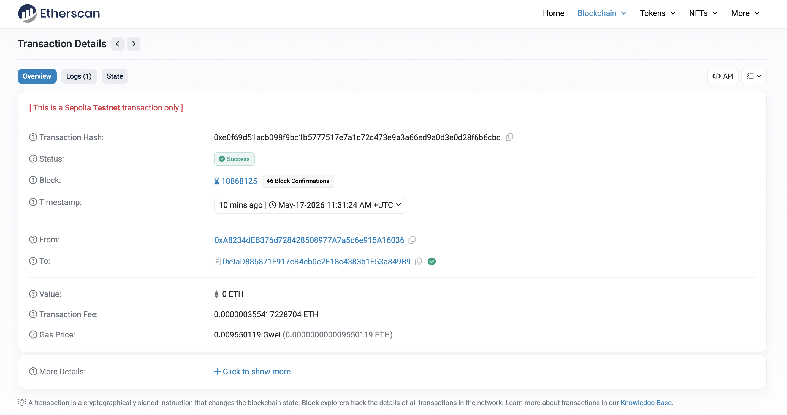
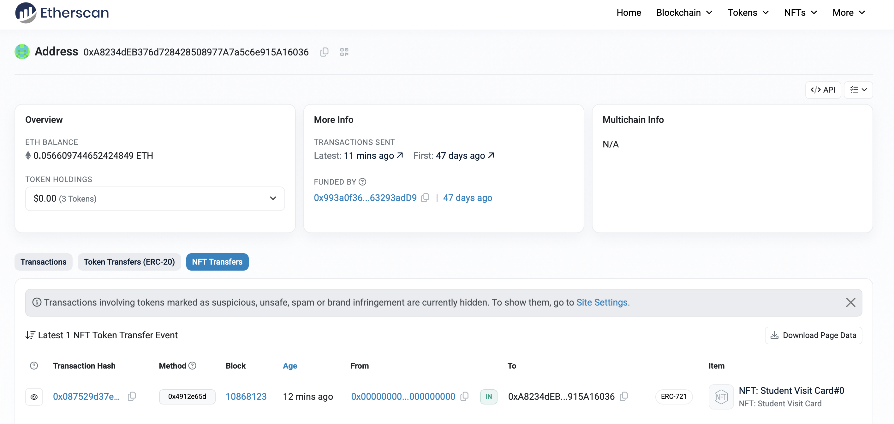
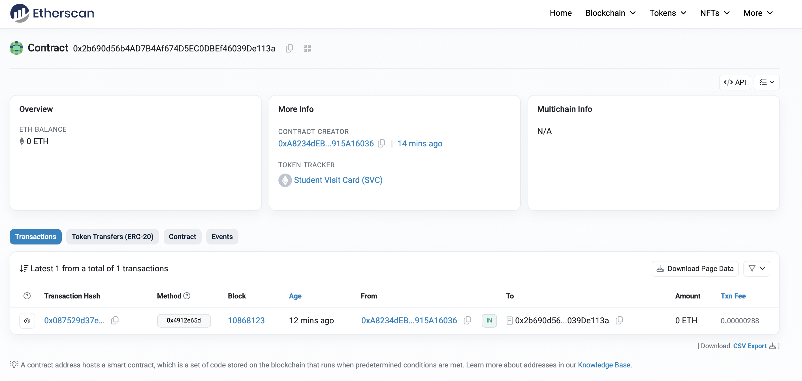
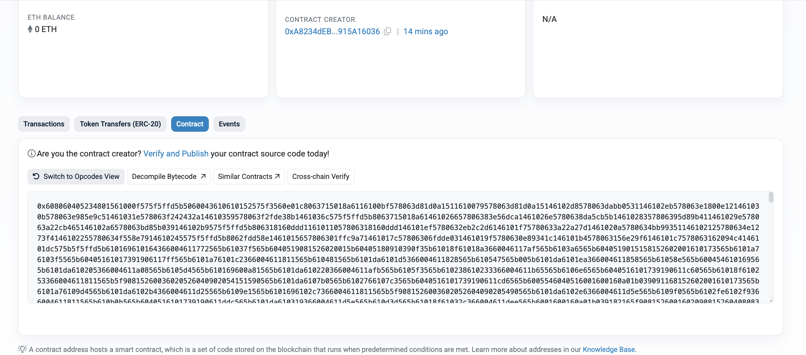

# Task 9 — NFT Contracts: Soulbound ERC-721 & Game Characters ERC-1155

Two separate Solidity contracts deployed on Ethereum Sepolia testnet.

---

## Deployed Contracts

| Contract | Address | Etherscan |
|---|---|---|
| `SoulboundVisitCardERC721` | `0x2b690d56b4AD7B4Af674D5EC0DBEf46039De113a` | [View](https://sepolia.etherscan.io/address/0x2b690d56b4AD7B4Af674D5EC0DBEf46039De113a) |
| `GameCharacterCollectionERC1155` | `0x9aD885871F917cB4eb0e2E18c4383b1F53a849B9` | [View](https://sepolia.etherscan.io/address/0x9aD885871F917cB4eb0e2E18c4383b1F53a849B9) |

---

## SoulboundVisitCardERC721

**Token name:** Student Visit Card (`SVC`)

Represents a student's unique digital identity card. The token is **soulbound** — it cannot be transferred or approved after minting. Only the contract owner can mint. Each wallet can hold at most one card.

### On-chain metadata (stored in the contract)

| Field | Type | Example |
|---|---|---|
| `studentName` | `string` | `"Daniil Tsitavets"` |
| `studentID` | `string` | `"STU-2024-001"` |
| `course` | `string` | `"Blockchain Development"` |
| `year` | `uint256` | `2024` |

### Soulbound mechanism

- `_update()` is overridden to allow only minting (when `from == address(0)`). Any transfer call reverts.
- `approve()` and `setApprovalForAll()` are overridden to always revert.

---

## GameCharacterCollectionERC1155

**Collection name:** Game Character Collection (`GCC`)

10 unique game characters (token IDs 0–9), each with on-chain attributes and an IPFS metadata URI. Supports batch minting and batch transfers.

### Characters

| ID | Name | Rarity | Speed | Strength | Color |
|---|---|---|---|---|---|
| 0 | Fire Warrior | Legendary | 85 | 95 | Red |
| 1 | Ice Mage | Epic | 70 | 90 | Blue |
| 2 | Earth Golem | Rare | 30 | 100 | Brown |
| 3 | Wind Archer | Rare | 95 | 65 | Green |
| 4 | Shadow Rogue | Epic | 90 | 75 | Black |
| 5 | Thunder Knight | Legendary | 80 | 92 | Yellow |
| 6 | Water Healer | Uncommon | 60 | 55 | Cyan |
| 7 | Light Paladin | Rare | 65 | 85 | White |
| 8 | Dark Sorcerer | Epic | 75 | 88 | Purple |
| 9 | Nature Druid | Uncommon | 55 | 70 | Green |

---

## Setup

### 1. Install dependencies

```bash
cd hardhat-app
npm install
```

### 2. Configure environment

Create `hardhat-app/.env`:

```env
PRIVATE_KEY=your_wallet_private_key_without_0x
ALCHEMY_API_KEY=your_alchemy_api_key
STUDENT_WALLET=0xStudentWalletAddress
ERC721_METADATA_URI=ipfs://QmYourCID
ERC1155_URI_0=ipfs://QmYourCID_0
# ... up to ERC1155_URI_9
```

---

## Metadata Structure

Metadata JSON files are located in `metadata/`. They conform to the OpenSea/ERC-1155 metadata standard.

**ERC-721** (`metadata/erc721/visit-card.json`):
```json
{
  "name": "Student Visit Card — Daniil Tsitavets",
  "description": "Soulbound NFT Visit Card...",
  "image": "ipfs://<CID>",
  "attributes": [
    { "trait_type": "studentName", "value": "Daniil Tsitavets" },
    { "trait_type": "studentID",   "value": "STU-2024-001" },
    { "trait_type": "course",      "value": "Blockchain Development" },
    { "trait_type": "year",        "display_type": "number", "value": 2024 }
  ]
}
```

**ERC-1155** (`metadata/erc1155/0.json` … `9.json`):
```json
{
  "name": "Fire Warrior",
  "description": "A legendary warrior...",
  "image": "ipfs://<CID>",
  "attributes": [
    { "trait_type": "Color",    "value": "Red" },
    { "trait_type": "Rarity",  "value": "Legendary" },
    { "trait_type": "Speed",   "display_type": "number", "value": 85 },
    { "trait_type": "Strength","display_type": "number", "value": 95 }
  ]
}
```

Metadata is hosted on IPFS via Pinata. CIDs are set in `.env` and passed to contracts via `setTokenURIBatch()` in `interact.js`.

---

## Deployment

```bash
cd hardhat-app
npm run deploy
```

Expected output:
```
Deploying with account: 0xA8234dEB376d728428508977A7a5c6e915A16036
Balance: 0.056686645841514063 ETH

Deploying SoulboundVisitCardERC721...
SoulboundVisitCardERC721: 0x2b690d56b4AD7B4Af674D5EC0DBEf46039De113a

Deploying GameCharacterCollectionERC1155...
GameCharacterCollectionERC1155: 0x9aD885871F917cB4eb0e2E18c4383b1F53a849B9

Addresses saved to deployed.json
```

---

## Minting & Interactions

```bash
cd hardhat-app
npm run interact
```

The script performs all operations in sequence:

| Step | Action |
|---|---|
| 1 | Sets IPFS URIs for all 10 ERC-1155 characters (batch) |
| 2 | Mints soulbound visit card (ERC-721) to student wallet |
| 3 | Batch mints 1 of each character (10 NFTs) to owner |
| 4 | Batch transfers characters #0 and #1 to student wallet |
| Bonus | Verifies soulbound: transfer attempt reverts |

---

## Proof of Functionality

### Transaction Hashes

| Action | Tx Hash | Etherscan |
|---|---|---|
| Mint soulbound visit card (ERC-721) | `0x087529d37eb26da86428340b445ee251fea1289bc732fb7643585075251ec89c` | [View](https://sepolia.etherscan.io/tx/0x087529d37eb26da86428340b445ee251fea1289bc732fb7643585075251ec89c) |
| Batch mint 10 game characters (ERC-1155) | `0xab995aad877a48c41cd9634fb2c73f267bcca753baf5d3e58a87b5f48161564b` | [View](https://sepolia.etherscan.io/tx/0xab995aad877a48c41cd9634fb2c73f267bcca753baf5d3e58a87b5f48161564b) |
| Batch transfer #0 and #1 to student wallet | `0xe0f69d51acb098f9bc1b5777517e7a1c72c473e9a3a66ed9a0d3e0d28f6b6cbc` | [View](https://sepolia.etherscan.io/tx/0xe0f69d51acb098f9bc1b5777517e7a1c72c473e9a3a66ed9a0d3e0d28f6b6cbc) |

### Soulbound verification

Transfer attempt output:
```
Correctly reverted: SoulboundVisitCard: token is soulbound and cannot be transferred
```

### Screenshots

**1. Mint soulbound visit card (ERC-721)**


**2. Batch mint 10 game characters (ERC-1155)**


**3. Batch transfer characters #0 and #1 to student wallet**


**4. Student wallet NFT transfers**


**5. SoulboundVisitCardERC721 contract on Etherscan**


**6. GameCharacterCollectionERC1155 contract on Etherscan**


---

## Project Structure

```
hardhat-app/
├── contracts/
│   ├── SoulboundVisitCardERC721.sol
│   └── GameCharacterCollectionERC1155.sol
├── scripts/
│   ├── deploy.js       # deploys both contracts
│   └── interact.js     # mints and transfers
├── metadata/
│   ├── erc721/
│   │   └── visit-card.json
│   └── erc1155/
│       ├── 0.json  (Fire Warrior)
│       ├── 1.json  (Ice Mage)
│       ├── 2.json  (Earth Golem)
│       ├── 3.json  (Wind Archer)
│       ├── 4.json  (Shadow Rogue)
│       ├── 5.json  (Thunder Knight)
│       ├── 6.json  (Water Healer)
│       ├── 7.json  (Light Paladin)
│       ├── 8.json  (Dark Sorcerer)
│       └── 9.json  (Nature Druid)
├── hardhat.config.js
└── package.json
```

---

## Technical Stack

- Solidity `0.8.28`, EVM target: Cancun
- OpenZeppelin Contracts `^5.0.0`
- Hardhat `^2.22.0`
- IPFS via Pinata
- Network: Ethereum Sepolia testnet