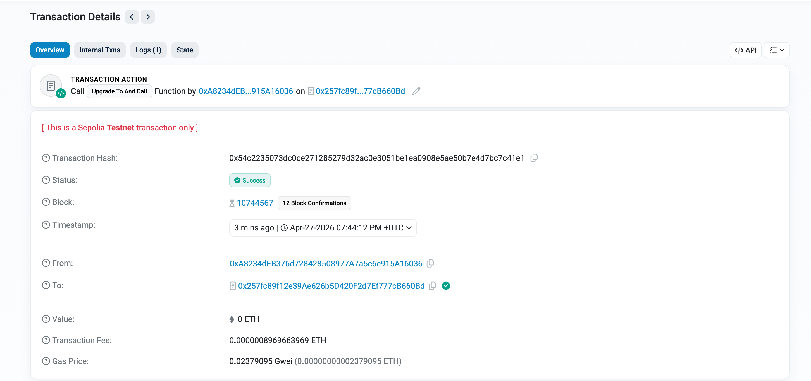
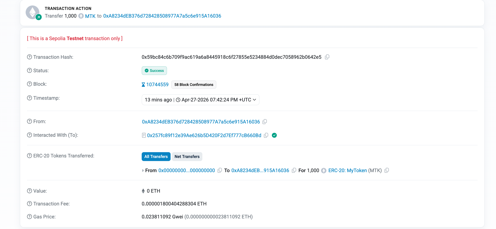
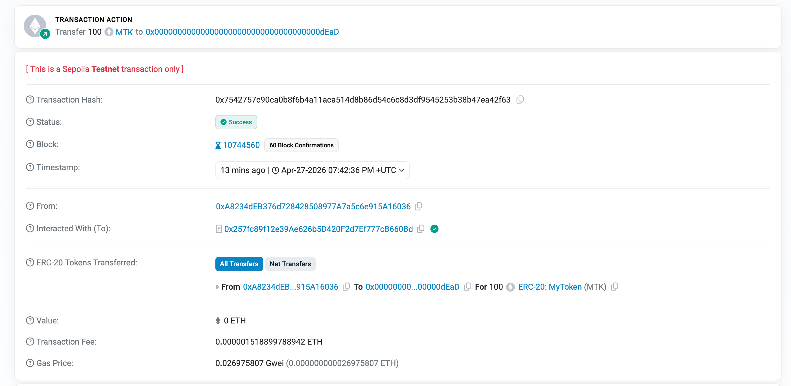
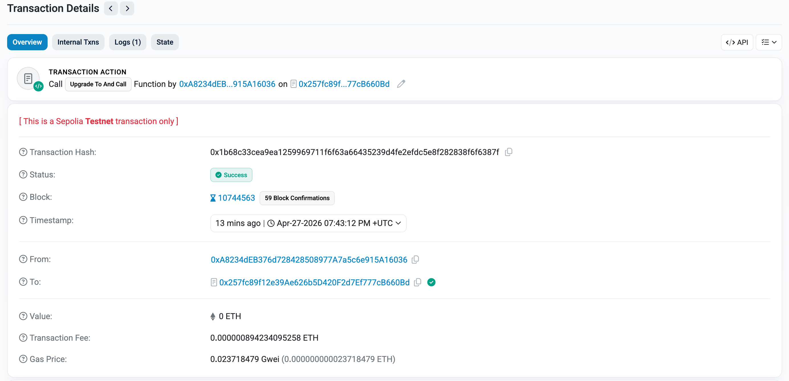

# Upgradeable ERC20 (UUPS Proxy)

### Overview

Deployed an upgradeable ERC20 token using the **UUPS (Universal Upgradeable Proxy Standard)** pattern on the **Sepolia** testnet.

- **V1** — standard ERC20 with `mint(address, amount)` function
- **V2** — same as V1 plus `version()` function returning `"V2"`
- The **proxy** address stays constant; only the implementation is swapped on upgrade
- Token balances are preserved through the upgrade

### Contracts

| Contract | Address | Etherscan |
|---|---|---|
| Proxy | `0x257fc89f12e39Ae626b5D420F2d7Ef777cB660Bd` | [View](https://sepolia.etherscan.io/address/0x257fc89f12e39Ae626b5D420F2d7Ef777cB660Bd) |
| Implementation V1 | `0xD896fA811498C2E8C7E099388D599ac86ef3CF09` | [View](https://sepolia.etherscan.io/address/0xD896fA811498C2E8C7E099388D599ac86ef3CF09) |
| Implementation V2 | `0x4bA1Dff7F37Ed724A191da8Ab0c80162D15817aA` | [View](https://sepolia.etherscan.io/address/0x4bA1Dff7F37Ed724A191da8Ab0c80162D15817aA) |

### Transactions

| Action | Tx Hash | Etherscan |
|---|---|---|
| Deploy Proxy + V1 | `0x257fc89f12e39Ae626b5D420F2d7Ef777cB660Bd` | [View](https://sepolia.etherscan.io/address/0x257fc89f12e39Ae626b5D420F2d7Ef777cB660Bd) |
| Mint 1000 MTK to owner | `0x59bc84c6b709f9ac619a6a8445918c6f27855e5234884d0dec7058962b0642e5` | [View](https://sepolia.etherscan.io/tx/0x59bc84c6b709f9ac619a6a8445918c6f27855e5234884d0dec7058962b0642e5) |
| Transfer 100 MTK to dead address | `0x7542757c90ca0b8f6b4a11aca514d8b86d54c6c8d3df9545253b38b47ea42f63` | [View](https://sepolia.etherscan.io/tx/0x7542757c90ca0b8f6b4a11aca514d8b86d54c6c8d3df9545253b38b47ea42f63) |
| Upgrade proxy to V2 | `0x54c2235073dc0ce271285279d32ac0e3051be1ea0908e5ae50b7e4d7bc7c41e1` | [View](https://sepolia.etherscan.io/tx/0x54c2235073dc0ce271285279d32ac0e3051be1ea0908e5ae50b7e4d7bc7c41e1) |

### Token balances after upgrade

| Address | Balance |
|---|---|
| Owner `0xA8234dEB376d728428508977A7a5c6e915A16036` | 900 MTK |
| Dead `0x000000000000000000000000000000000000dEaD` | 100 MTK |

### version() output after upgrade

```
V2
```

### Screenshots






### Deployment steps

```bash
cd hardhat-app

# 1. Install dependencies
npm install

# 2. Deploy proxy + V1 implementation
npx hardhat run scripts/deploy.js --network sepolia

# 3. Mint and transfer tokens via proxy
npx hardhat run scripts/interact.js --network sepolia

# 4. Upgrade proxy to V2
npx hardhat run scripts/upgrade.js --network sepolia
```

### Project structure

```
hardhat-app/
├── contracts/
│   ├── MyTokenV1.sol       # Upgradeable ERC20 V1 (UUPS)
│   └── MyTokenV2.sol       # ERC20 V2 with version() function
├── scripts/
│   ├── deploy.js           # Deploy proxy + V1
│   ├── interact.js         # Mint and transfer tokens
│   └── upgrade.js          # Upgrade proxy to V2
├── hardhat.config.js
└── deployed.json           # Saved contract addresses
```