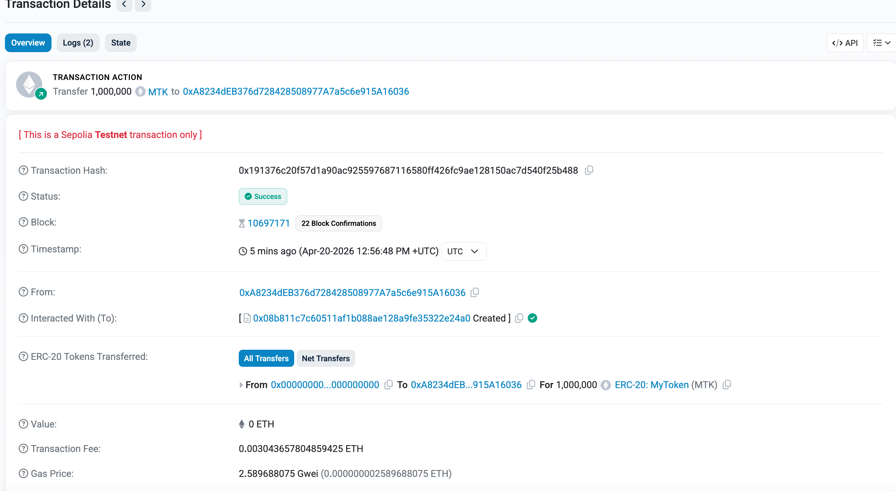

# MyToken (MTK) — ERC20 Token

ERC20 token built with Hardhat and OpenZeppelin. Includes minting restricted to the owner.

## Contract

- **Network:** Sepolia Testnet
- **Address:** `0x08b811c7c60511aF1b088aE128A9fe35322e24A0`
- **Explorer:** [View on Etherscan](https://sepolia.etherscan.io/address/0x08b811c7c60511aF1b088aE128A9fe35322e24A0)

## Token Details

| Property | Value |
|----------|-------|
| Name | MyToken |
| Symbol | MTK |
| Initial Supply | 1,000,000 MTK |
| Decimals | 18 |

## Deployment Screenshot


## Setup

```bash
npm install
```

## Compile

```bash
npx hardhat compile
```

## Test

```bash
npx hardhat test
```

## Deploy

Create a `.env` file:

```
PRIVATE_KEY=your_private_key
ALCHEMY_API_KEY=your_alchemy_api_key
```

Then run:

```bash
npx hardhat run scripts/deploy.js --network sepolia
```

## Tests

- Deployment: initial supply, owner, name/symbol
- Minting: owner can mint, non-owner cannot
- Transfers: between accounts, insufficient balance, balance updates
